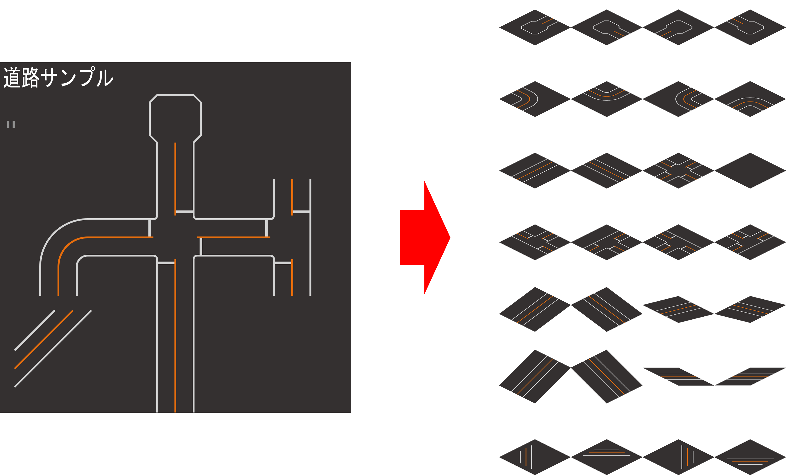
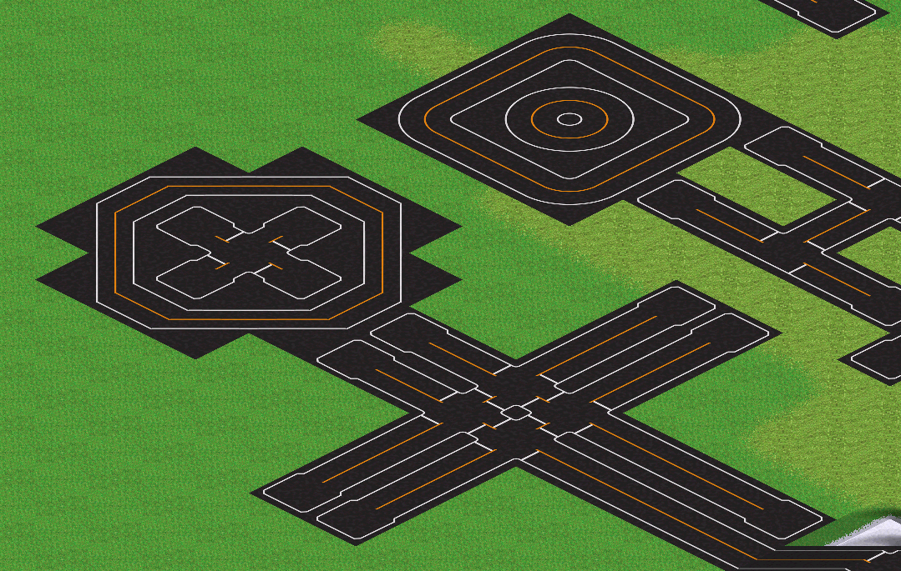

# Road Tile Generator

テクスチャ画像から線形変換を利用してSimutransの道路アドオン用タイル画像を生成するツールです。



# 導入 / Installation

事前にpython（3.12以上）のインストールが必要です。

```
pip install -r requirements.txt
```

# 使い方 / Usage

```
# 指定yamlファイルの変換を実行
python .\main.py .\demo\demo.yml
# 指定ディレクトリ内にあるすべてのyamlファイルの変換を実行
python .\main.py .\demo\
```
変換の都合上、タイル外周部分はアンチエイリアスがかかり透過色との相性が悪いです。
使用するpakサイズよりも一回り大きめで出力し、別ツール([simutrans-image-merger](https://github.com/128na/simutrans-image-merger)など)の併用をお勧めします。

1. テクスチャを512px四方で作成
2. このツールで変形して256pxの画像を生成
3. 別ツールで128px四方にトリミング、特殊色削除
4. makeobjでpak作成

## 用語

- テクスチャ画像
    線形変換前の正方形の画像のこと
- タイル画像
    Simutrans用の角度に線形変換された画像のこと


## パラメーター

設定例は [demo.yml](./demo/demo.yml) を確認してください。

### `rtg_version`

このアプリのメジャーバージョンです。バージョンが変わるとyamlファイルの互換性がなくなります。

### `options.interpolation_flags`

変換時の補完モード。cv::InterpolationFlagsで定義されている値を指定できます。
https://docs.opencv.org/4.10.0/da/d54/group__imgproc__transform.html

### `options.resolution`

1以上を設定すると線形変換前に画像を指定倍率拡大、返還後に縮小して処理します。
アンチエイリアスの効き方が変わるので好みに合わせて設定してください。

resolution=1

resolution=2

resolution=4


### `files`

出力ファイルごとの設定です。


### `files.rules.*.location`

画像の位置を指定します。datでの指定と同じです。

例） size=64, location=1,2の場合、(y,x) = (64,128)を始点に(w,h) = (64, 64)の領域となります

### `files.rules.*.size`

各画像の入出力サイズです。
未指定のときはデフォルト値(`files.*.default_size`)が使用されます。

### `files.rules.*.offset.x`, `files.rules.*.offset.y`

入出力画像のオフセット位置です。未指定のときは0になります

### `*.converts`

画像の線形変換方法を指定します。
使用可能な変換は [Transformsクラス](./src/Transforms.py) を確認してください。
